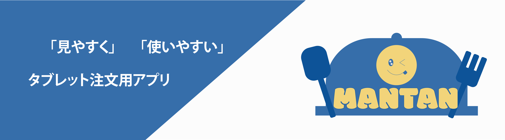

 

## アプリケーション概要
チーム制作授業の課題として、以下のテーマに沿って制作を進めました。

- 架空のファミリーレストラン『マンタン』のタブレット注文画面の設計・制作
- ユーザー（お客様）の立場に立ち、「見やすく」「使いやすい」注文体験を考えて形にしていくことが目的です

 

## チームメンバー
| 役割 | 名前 |
|------|------|
|チームリーダー|高見宇汰|
|マネージャー|山本淳平|
|デザイナー|高見宇汰、山本淳平、伊藤柚茉、宇野太貴|
|コーダー|高見宇汰、山本淳平、宇野太貴|

 

## 技術スタック
<table>
  <tr>
    <th>言語</th>
    <td>
      
      
      
    </td>
  </tr>
  <tr>
    <th>デザインツール</th>
    <td>
      
      
      
    </td>
  </tr>
  <tr>
    <th>開発ツール</th>
    <td>
      
      
      
      
    </td>
  </tr>
</table>

 

## アプリの画面
<table>
  <tr>
    <th>スタート画面</th>
    <th>カテゴリー画面</th>
  </tr>
  <tr>
    <td>
      
    </td>
    <td>
      
    </td>
  </tr>
  <tr>
    <th>メニュー画面</th>
    <th>お持ち帰りメニュー画面</th>
  </tr>
  <tr>
    <td>
      
    </td>
    <td>
      
    </td>
  </tr>
  <tr>
    <th>メニュー詳細画面</th>
    <th>注文カゴ画面</th>
  </tr>
  <tr>
    <td>
      
    </td>
    <td>
      
    </td>
  </tr>
  <tr>
    <th>注文履歴画面</th>
    <th>お会計画面</th>
  </tr>
  <tr>
    <td>
      
    </td>
    <td>
      
    </td>
  </tr>
</table>

 

## 今後の展望
今後はNode.jsなどを用いたバックエンドの開発も進めて、機能面が実際に動作するところまでは持っていきたいです。 
また、管理者画面なども実装できればメニューの新規追加、編集、削除の管理なども行えるので、これも今後進めていきたい事の一つです。
